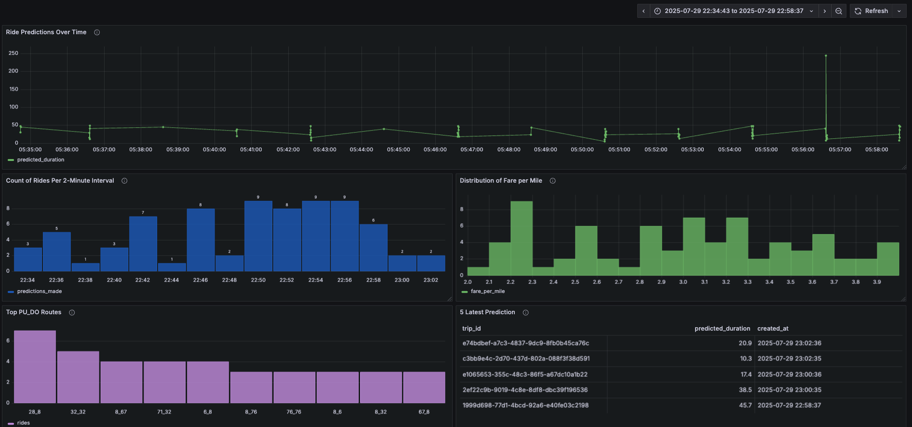

# Chicago Taxi Batch Deployment 🚖
This repository contains the batch deployment pipeline for predicting taxi trip durations in Chicago using a trained machine learning model. The system is designed for realistic data generation, scheduled inference, and database storage and real time dashboard monitoring using tools like Prefect, Flask, MLflow, PostgreSQL and Grafana.

---

## 📁 Project Structure
```bash
batch-deployment/
├── docker-compose.yml              # Docker configuration for Postgres, Adminer, and Grafana
├── predict.py                      # Flask app with Prefect flow to predict and log trip durations
├── README.md                       # Project documentation
├── config/
│   └── grafana_dashboards.yaml     # Grafana provisioning config that loads dashboards 
├── dashboards/
│   └── batch_predictions.json       # Grafana dashboard JSON with panel definitions 
```

---

## ⚙️ Components

### 🧠 ML Model
- **Model:** Random Forest Regressor
- **Versioning:** Managed with MLflow
- **Stage:** `Production`
- **Tracking URI:** `http://127.0.0.1:5000`

### 🎯 Functionality
- Generates **synthetic but realistic taxi rides** biased toward actual Chicago pickup/drop-off areas and peak hours.
- Predicts trip duration using a deployed model stored in the MLflow Model Registry.
- Logs each prediction (with metadata) into a PostgreSQL database.
- **UUID-based trip ID** is generated for each record.
- Runs every 5 minutes as a **Prefect 2.0 flow** (can be scheduled through Prefect Cloud/Server).
- Offers a simple **Flask endpoint** for status check.
- The functions was developed to run randomly 1 - 10 predictions per 2 minutes to more align with real case scenario
- The **grafana** dashboard was then build to monitor the prediction include:

| Column Name            | Description                                                   |
| ---------------------- | ------------------------------------------------------------- |
| `ride prediction`      | Time series chart showing predicted ride durations over time. |
| `count of ride`        | Bar chart showing the number of rides every 2 minutes.        |
| `distribution of fare` | Histogram showing the distribution of fare per mile.          |
| `top PU_DO`            | Bar chart showing the most common pickup/dropoff pairs.       |
| `latest prediction`    | Table displaying the 5 most recent predictions.               |


<p align="center">
  
</p>

---

## 🛠️ Technologies Used

- **Flask**: Lightweight web server
- **MLflow**: Model tracking, registry, and artifact management
- **PostgreSQL**: Storage for predictions
- **APScheduler**: Time-based job scheduling
- **pandas**, **uuid**, **psycopg**, **scikit-learn**, **pickle**

---

## 🚀 Getting Started

### 1. Clone the Repository

```bash
git clone https://github.com/your-username/chicago-taxi-batch-deployment.git
cd batch-deployment
```

### 2. Start the MLFLOW UI
Since the tracking server was stored at workflow-orchestration folder which using **mage** we need to start the mlflow tracking server from this folder to get the current model.

```bash
cd CHICAGO-TAXI-MLOPS/workflow-orchestration/
mlflow ui --backend-store-uri sqlite:///mlflow.db
```


### 3. Start MLflow and PostgreSQL via Docker

Navigate back to the model ```deployment/batch-deployment``` to run: 

```bash
docker-compose up
```

### 4. Run Flask App with Prefect Flow
```bash
python predict.py
```

- The app starts a local Flask server at http://localhost:9696.
- Schedules a background job using APScheduler to run every 5 minutes

## 🗃️ Database Output
The batch prediction results are saved into a PostgreSQL table: ride_predictions. The schema includes:

| Column Name              | Type      | Description                                  |
| ------------------------ | --------- | -------------------------------------------- |
| `trip_id`                | UUID      | Unique ID for the ride                       |
| `pickup_community_area`  | INTEGER   | Origin community area                        |
| `dropoff_community_area` | INTEGER   | Destination community area                   |
| `trip_start_timestamp`   | TIMESTAMP | Start time of the ride                       |
| `fare`                   | FLOAT     | Calculated fare                              |
| `trip_total`             | FLOAT     | Total cost including extra fees              |
| `trip_miles`             | FLOAT     | Distance traveled in miles                   |
| `predicted_duration`     | FLOAT     | Model prediction for trip duration (minutes) |
| `created_at`             | TIMESTAMP | Time the record was inserted                 |


## ✨ Why This Project Stands Out
This project showcases a real-world batch inference system that combines:

- Machine learning deployment with MLflow

- Modular data engineering using Prefect

- Reliable scheduling using APScheduler

- Automated PostgreSQL data logging

- Dockerized service architecture

- Grafana real - time prediction monitor dashboard

It demonstrates end-to-end skills in model serving, workflow orchestration, task scheduling, system integration, and real-time monitoring with Grafana—making it a strong example of practical MLOps and data engineering in a production-ready environment.


## 👤 Author

Dario Dang

ML Engineer | MLOps Enthusiast | DataOps Practitioner


