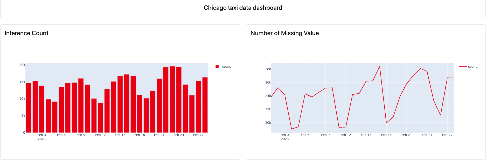
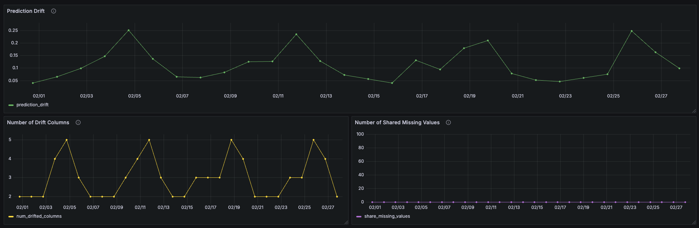

# 🚖 Chicago Taxi Model Monitoring

This repository contains the monitoring infrastructure for evaluating the performance and quality of a machine learning model that predicts taxi trip durations in Chicago. It includes data quality reports, drift analysis, and dashboards built using Evidently, Grafana, and PostgreSQL.

---

## 📦 Project Structure
```bash
model-monitoring/
├── docker-compose.yaml                  # Docker services: Grafana, PostgreSQL, Adminer
├── evidently-metrics-calculation.py     # Python script to generate Evidently reports
├── prediction-drift.ipynb               # Notebook to analyze prediction drift
├── config/                              # Configuration files for Grafana provisioning
│   ├── grafana_datasources.yaml
│   └── grafana_dashboards.yaml
├── dashboards/                          # JSON dashboards for Grafana
│   └── predict_drift.json
├── image/Evidently_UI.png                     # Screenshot of Evidently dashboard
├── image/Grafana_Dashboard.png                # Screenshot of Grafana dashboard
└── README.md  
```

## ⚙️ Key Components
### 📊 Evidently

1. Run the ```prediction_drift.ipynb``` to generate evidently UI report 

2. Run ```evidently ui``` on bash to start the evidently user interface 

<p align="center">
  
</p>

- Used to compute data quality, missing values, and distribution drift.

- Generates daily reports comparing df_feb (current data) to df_jan (reference data).

- Metrics are stored and visualized in a dashboard panel using Evidently UI.


### 📈 Grafana

- Take the ```January_Chicago``` predicted dataset as a reference data.

- Make a prediction on ```February_Chicago``` dataset for calculate prediction drift.

<p align="center">
  
</p>

- Visualizes prediction drift, missing values, and feature drift using time-series plots.

- Pulls metrics from stored reports and presents them in a clear and interactive UI.

### 🐘 PostgreSQL + Adminer

- Stores prediction results (via batch inference) for future analysis.

- Adminer allows easy SQL query and table inspection through a browser at http://localhost:8080.

## 🚀 How to Run the Monitoring Stack

1. Clone the Repository
```bash
git clone https://github.com/your-username/model-monitoring.git
cd model-monitoring
```

2. Start Docker Services
```bash
docker compose up --build -d
```

- Grafana: http://localhost:3000 (default user: admin, password: admin)

- Adminer: http://localhost:8080 (see the configure on ```evidently-metrics-calculation.py```)

3. Generate Evidently Reports
```bash
python evidently-metrics-calculation.py
```

### 📌 Monitoring Metrics Tracked

| Panel Title               | Description                                 |
| ------------------------- | ------------------------------------------- |
| Inference Count           | Number of daily inferences                  |
| Number of Missing Value   | Total missing values per day                |
| Daily Missing Value Count | Missing values trend (line plot)            |
| Drifted Feature Count     | Number of drifted features between datasets |
| Prediction Drift Score    | Difference in model predictions over time   |


## ✨ Highlights & Why It Matters
This project showcases real-world ML model monitoring infrastructure with:
    - Automated daily validation
    - Drift and anomaly detection
    - Real-time dashboards
    - Dockerized deployment for reproducibility
    - It highlights strong skills in:
    - MLOps using MLflow, Docker, Evidently, and Grafana
    - Production-grade ML model validation
    - Cloud-native artifact handling (S3-based workflows)

## 👤 Author

Dario Dang

ML Engineer | MLOps Enthusiast | DataOps Practitioner