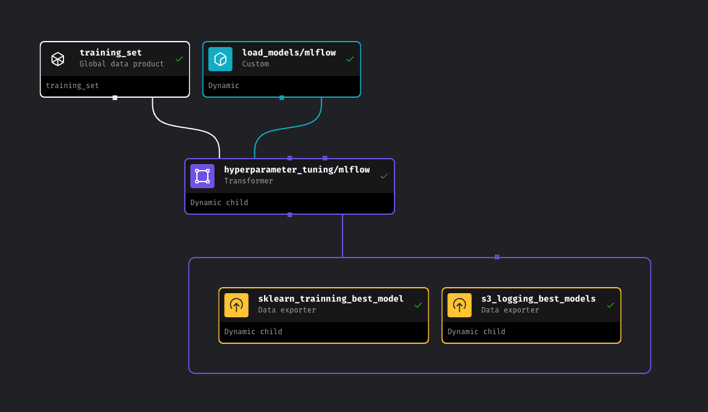

# 🚖 Chicago Taxi MLOps Pipeline (Mage + MLflow + S3)

This repository contains an end-to-end Machine Learning pipeline built using Mage for orchestrating workflows, **MLflow** for experiment tracking and model registry, and **AWS S3** for storing trained models.

The goal of this pipeline is to train and evaluate different models to predict taxi trip durations in Chicago and deploy the best-performing model.

---
## 🧭 Pipeline Overview

<p align="center">
  
</p>

---
## 📁 Project Structure

```bash
├── workflow-orchestration/        # Mage project root
│
├── mlartifacts/                   # Local artifacts (if not using S3)
│
├── mlops/                         # Core Python modules for Mage blocks
│   ├── data_preparation/          # Feature engineering and preprocessing
│   ├── pipelines/                 # Mage pipeline definitions
│   ├── presenters/                # Optional presentation logic
│   ├── training/                  # Model training logic
│   ├── utils/                     # Utility functions (e.g., S3 logging)
│   ├── __init__.py
│   ├── design.yaml
│   ├── metadata.yaml
│   ├── settings.yaml
│   └── requirements.txt
│
├── mlruns/                        # MLflow local experiment logs                 
│
├── mlflow.db                      # Local MLflow metadata database
│
└── README.md                      # Project overview
```

### 🚀 Key Features
- Dynamic Model Training: Trains multiple models (RandomForest, GradientBoosted, LinearRegression) using dynamic blocks.

- Hyperparameter Tuning: Each model is trained with its best-tuned hyperparameters.

- MLflow Logging: Logs metrics, parameters, artifacts, and model versions to an MLflow tracking server.

- S3 Model Storage: Only the best model (RandomForest) is stored in an S3 bucket under models/.

- Model Registry: RandomForest is automatically registered and promoted to the Production stage in MLflow.


### 🧩 Pipelines Overview
```mlops``` pipeline (main)
1. This pipeline orchestrates the following blocks:

2. Data Preparation – Loads and transforms training data.

3. Hyperparameter Tuning (dynamic) – Runs parallel tuning for multiple model types.

4. Train Final Model – Trains the best model on the full dataset.

5. Track to MLflow – Logs all models, registers only RandomForest.

### 🛠️ Technologies Used
- Mage for building modular, maintainable pipelines

- MLflow for tracking and registering models

- AWS S3 as the remote artifact store

- Scikit-learn and XGBoost for modeling

- Docker (optional) for local development

- Python 3.9+

### ☁️ S3 and MLflow Configuration

#### 1. Install dependencies
Make sure you have Python 3.x and the required packages installed. You can install dependencies using:
```bash
pipenv shell 
pipenv lock
```

#### 2. Set the following environment variables or edit s3_logging.py:
```bash
export MLFLOW_TRACKING_URI=http://127.0.0.1:5000
export MLFLOW_ARTIFACT_URI=[your-aws-s3-storage-name]  # e.g: s3://dario-mlflow-models-storage/models
```

Ensure your AWS credentials are configured (~/.aws/credentials or env vars).

### ✅ To Run Locally
#### 1. Start Mage:
```bash
pipenv run mage start mlops
```

#### 2. Start MLflow tracking server:
```bash
mlflow server \
  --backend-store-uri sqlite:///mlflow.db \
  --default-artifact-root [your-aws-s3-artifact] \
  --host 0.0.0.0 --port 5000
```

### 🧪 Model Registry Logic
Only RandomForestRegressor is:

Logged to the randomforest-reg model registry

Promoted to the Production stage

Stored under the models/ directory in the configured S3 bucket

Other models are logged to MLflow but not registered or stored in S3.

### ✍️ Author
Dario Dang

MLOps Engineer | Data Enthusiast